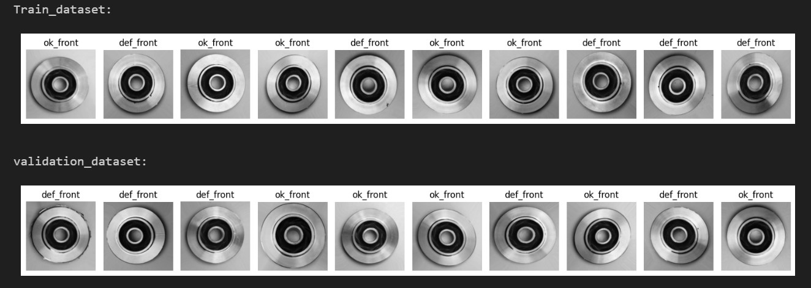
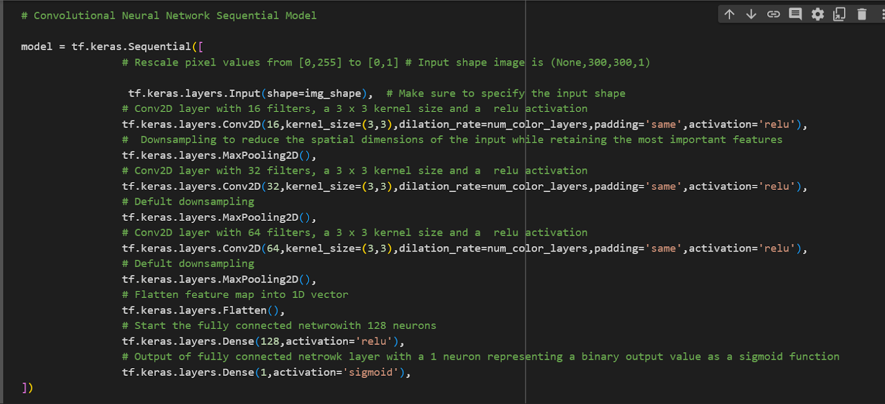
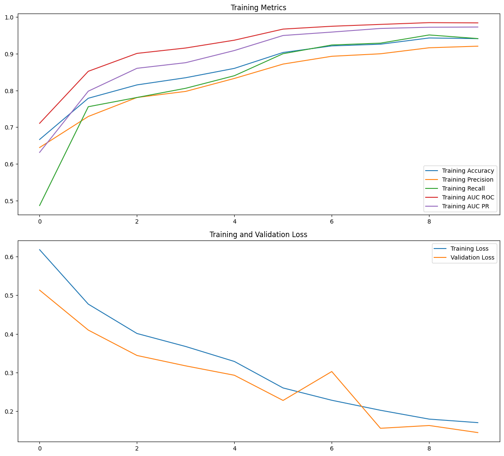
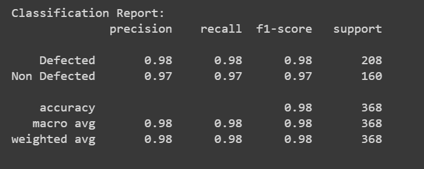
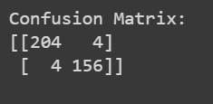
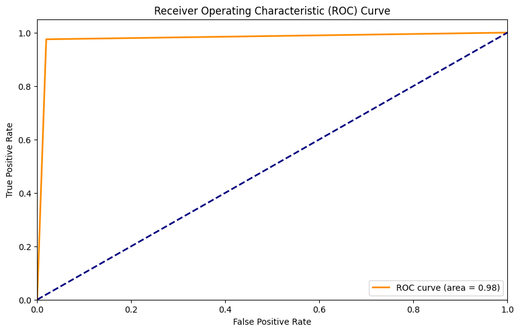
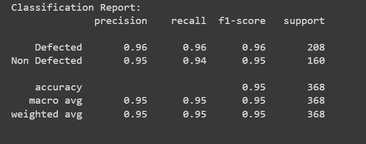
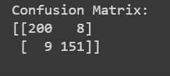
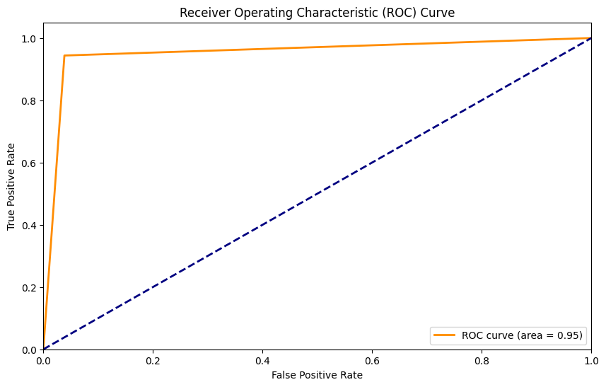
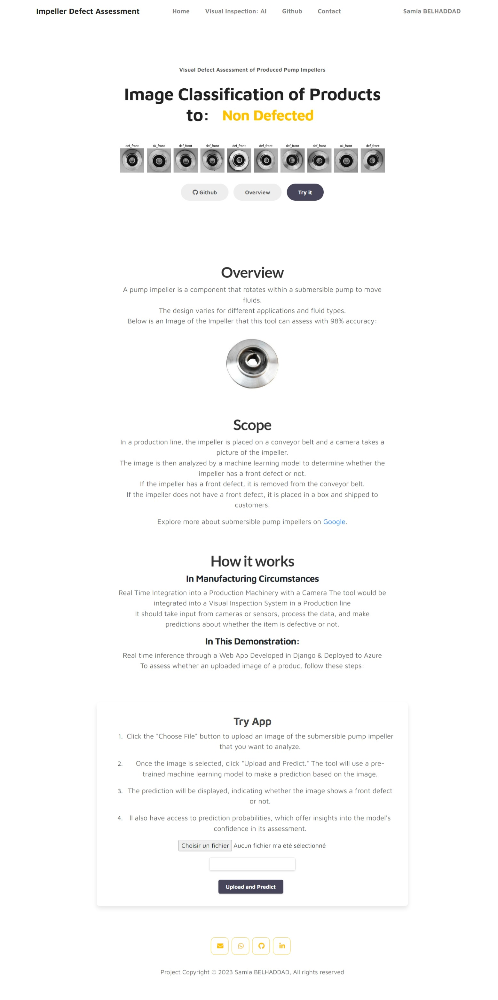

<h3 align="center" style=" line-height: 1.5;">The project is a Computer Vision-Based Defect Assessment System of Images of Pump Impellers. 

 
The full working django app can be accessed at <a >impellerdefectasssessment.azurewebsites.net</a>

The Github Repo for the Django Project can be accessed at <a >https://github.com/Hypatchia/DefectAssessment-Images-Django</a></h3>

## Project Overview
In the field of industrial maintenance, where precision and efficiency are crucial, this work stands out.

The primary objective is to provide a robust and accurate system capable of identifying and classifying defects in pump impeller images. By harnessing the power of advanced computer vision techniques and machine learning, the aim is to elevate maintenance practices and enhance overall equipment reliability.

The main goal is to establish a reliable system for identifying and categorizing defects in pump impeller images. By utilizing advanced computer vision and machine learning, the intention is to improve maintenance practices and boost overall equipment reliability.

This work holds significance as it seeks to redefine maintenance approaches. The focus is on introducing practical solutions that go beyond industry standards. Identifying and categorizing defects is not just about diagnosis but a proactive step to address issues early, minimizing downtime, and optimizing equipment reliability.

### Built with:

## Approach
- Load & Process Images into a uniform Scale & Create Train Validation Batched Datasets
- Experiment with Various Architectures of a CNN (Activations, Filters, Dropout...)
- Train & Evaluate the model & HyperParameter Tuning.
- Apply Weight Clustering Model Compression to enhance model for the Django App Inference Time & Speed.

## Dataset

 The deep learning model was trained on a dataset of product images. The dataset consists of labeled RGB images of Submersible Pump Impellers, with each image categorized as either "defected front" or "ok front."

  

* The dataset contains:
8648 RGB Images of different sizes

* A link to the dataset: <a>https://www.kaggle.com/datasets/ravirajsinh45/real-life-industrial-dataset-of-casting-product</a>

## Image Processing:

To prepare the images for training and prediction, the following processing steps were performed:

* Images were loaded into their respective training and validation directories using TensorFlow data generator.
* Resizing: Images were resized to a consistent size to ensure uniform input for the neural network.
* Conversion to Grayscale: Images were converted to grayscale to reduce the complexity and size of the data while retaining essential features.

## Training a Convolutional Neural Network for Binary Image Classification

* A Convolutional Neural Network (CNN) was designed to perform binary image classification. The CNN is trained on the labeled dataset, learning to distinguish between defective and defect-free products.

* The CNN architecture is as follows:

  

## Model Evaluation:

* To evaluate the performance of the trained model and ensure its accuracy and reliability in predicting product defects, the metrics used were accuracy, precision, and recall.

* The Training, Validation Loss and Training Metrics are shown in the figure:

  

 <li> The Evaluation Metrics on Newly Unseen Data gave the Classification Report: </li>

  

 <li> The Confusion Matrixon Newly Unseen Data gave:</li>

  

 <li> The AUC ROC Results are:</li>

  

## Model Compression: Weight Clustering: 68% Smaller Model.

 
* The Evaluation of the Compressed Model show:

 
<li>
Classification Report:</li>

  

 
<li>
Confusion Matrix:</li>

  

 
<li>
AUC ROC Curves:</li>

  

## Web App

* A defect assessment web system was built using Django that allows the upload of an image of a product, processing, and then prediction of its status as 'defected or defect-free.'

* The process includes loading the pretrained deep learning model from Azure Blob storage, preprocessing the image, converting it to grayscale, and then making the final prediction of the product's status as "defected" or "defect-free."

* A screenshot of the app is available:

  

* The full working danago app can be accessed at <a >impellerdefectasssessment.azurewebsites.net</a>

* The Github Repo for the Django Project can be accessed at <a >https://github.com/Hypatchia/DefectAssessment-Images-Django</a></h3>

## Setup to run 

* Clone Repository
* Navigate to directory
* Create Virtual Environment & Activate it
* Install requirements
~~~
pip install requirements.txt
~~~
* Navigate to pipeline to:
    * Run the app (using scripts):
    ~~~
    python main.py
    ~~~
    * Run notebooks in the notebooks directory  
    * View Models at model directory

## Contact
 Feel free to reach out to me on LinkedIn or through email & don't forget to visit my portfolio.
 

